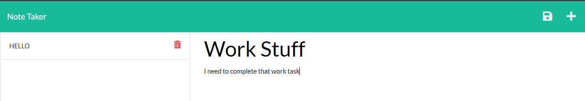
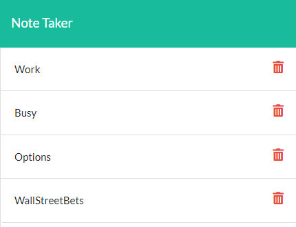

# Note Taker Machine
            
## Description 
  Take notes and have them saved on a server. Access those notes from any device connected to the internet.
       
## Table of Contents
            
 * [Usage](#usage)
 * [Questions](#questions)
 * [License](#license)
            
## Usage 
    Take notes and save/delete them from any device connected to the internet. 
    To start when directed to the page select get started on the landing page.

  

    After being redirected to the notes page. Write the title to your note followed by a description.

  

    To save or start a new note on the top left corner will be a floppy disk icon to save and a plus icon to create a new note.
  
  

    To delete a note select the trash icon next to saved note on the left hand side.

  

       
            
## License
    MIT License Copyright (c) 2022 Krystopher Quintero

    Permission is hereby granted, free of charge, to any person obtaining a copy
    of this software and associated documentation files (the "Software"), to deal
    in the Software without restriction, including without limitation the rights
    to use, copy, modify, merge, publish, distribute, sublicense, and/or sell
    copies of the Software, and to permit persons to whom the Software is
    furnished to do so, subject to the following conditions:

    The above copyright notice and this permission notice shall be included in all
    copies or substantial portions of the Software.

    THE SOFTWARE IS PROVIDED "AS IS", WITHOUT WARRANTY OF ANY KIND, EXPRESS OR
    IMPLIED, INCLUDING BUT NOT LIMITED TO THE WARRANTIES OF MERCHANTABILITY,
    FITNESS FOR A PARTICULAR PURPOSE AND NONINFRINGEMENT. IN NO EVENT SHALL THE
    AUTHORS OR COPYRIGHT HOLDERS BE LIABLE FOR ANY CLAIM, DAMAGES OR OTHER
    LIABILITY, WHETHER IN AN ACTION OF CONTRACT, TORT OR OTHERWISE, ARISING FROM,
    OUT OF OR IN CONNECTION WITH THE SOFTWARE OR THE USE OR OTHER DEALINGS IN THE
    SOFTWARE.

            
  ## Questions
  For questions you can contact me here on [GitHub](https://github.com/KrystopherQ).
            
        
